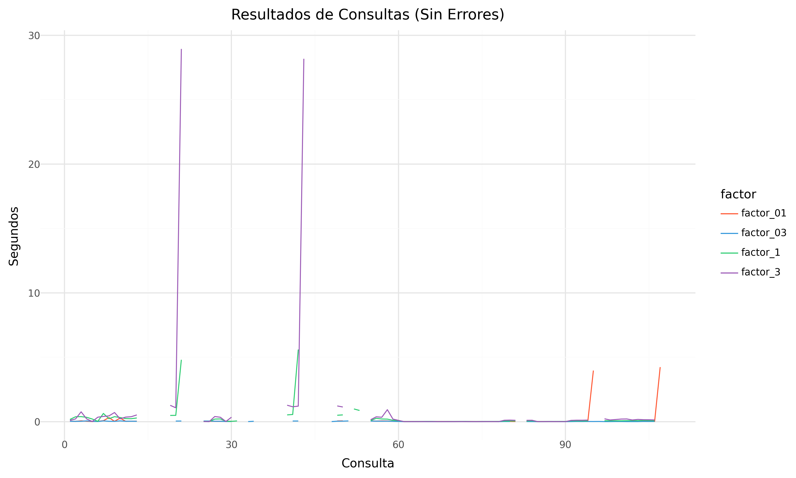
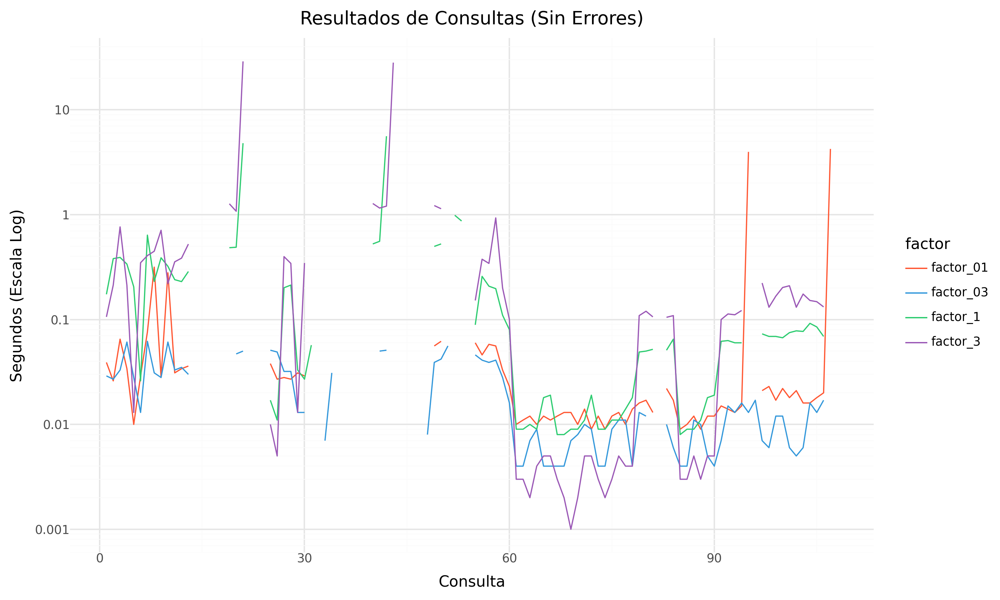
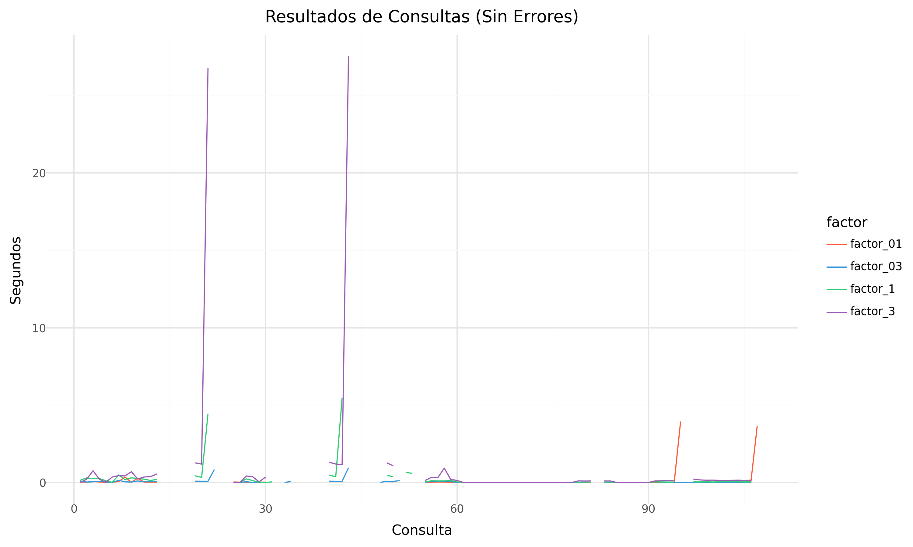
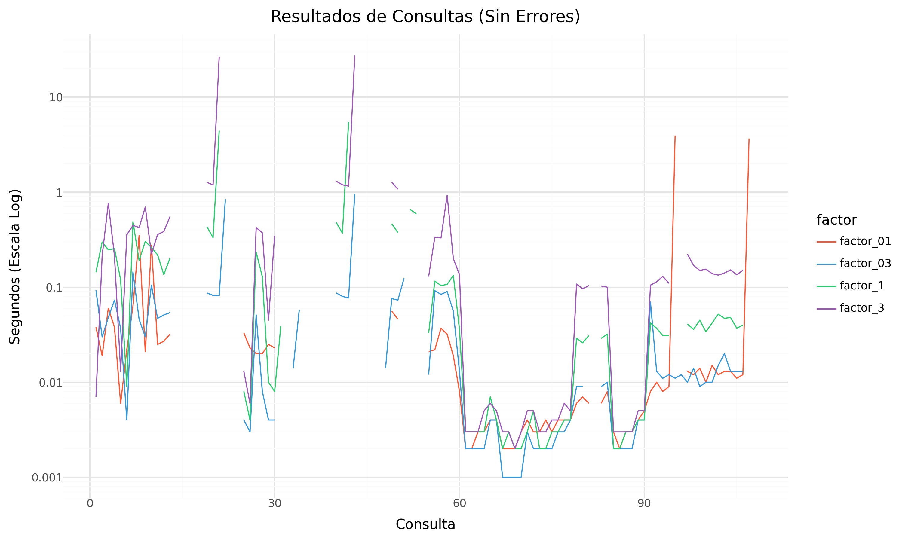
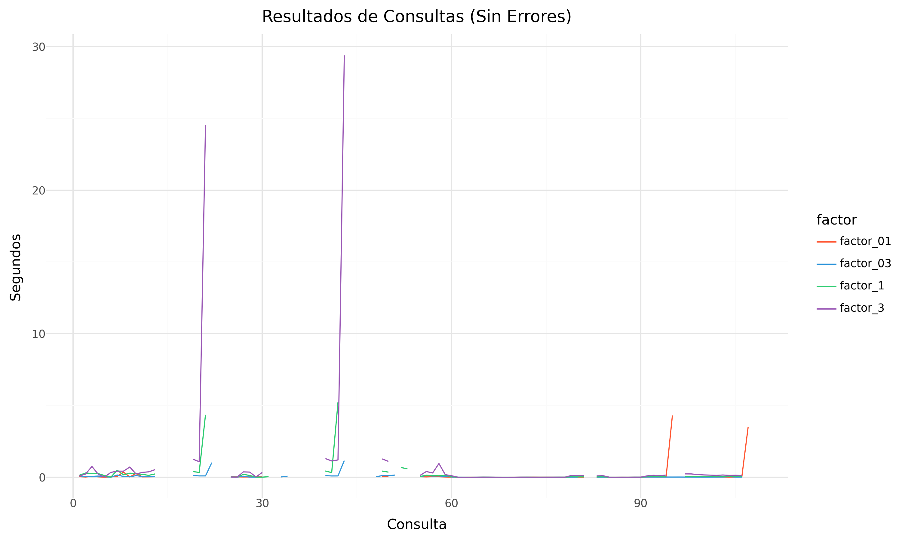
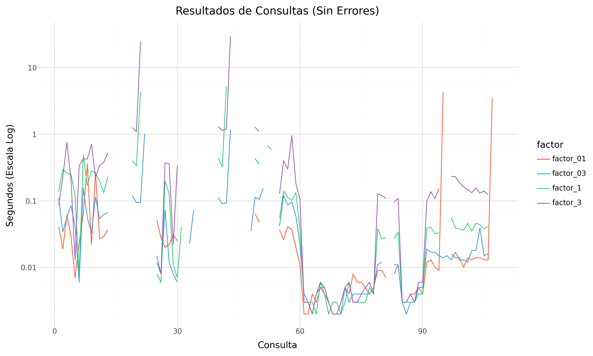

## Kuzu

Kuzu es una base de datos enfocada en manejar consultas con alta complejidad de joins y grafos de gran tamaño, para esto utiliza una implementación de open cypher como lenguaje de consulta.

###  Descripción general
Kuzu es una base de datos orientada a grafos que permite el manejo eficiente de consultas complejas, su diseño embebido permite su integración directa con aplicaciones sin necesidad de un servidor independiente, lo que facilita su implementación y configuración.

Se llevaron a cabo diversos experimentos para evaluar el rendimiento y las capacidades de Kuzu en el manejo de datos . Se utilizó una máquina virtual con Ubuntu en donde se realizaron variadas consultas de caminos con datos provenientes del LDBC social network benchmark, se automatizó la ejecución y medición de dichas consultas a través de distintos scripts. 

Además, se analizaron errores frecuentes, como timeouts y límites de memoria, para identificar las limitaciones del sistema en escenarios de alta demanda.

###  Repositorio

Todos los scripts, consultas y resultados obtenidos pueden ser consultados en:
https://github.com/urzuaf/repo_kuzu


## Instalación
Kuzu permite su uso mediante interfaz de linea de comandos (**CLI**) además de distintos lenguajes de programación.

Para los lenguajes de programación permite su uso mediante librerías en los principales gestores de dependencias de cada lenguaje, por ejemplo: 
#### Python
```bash
pip install kuzu
```

#### Javascript
```bash
npm install kuzu
```

#### Go
```bash
go get github.com/kuzudb/go-kuzu
```

Además de los lenguajes anteriores, se tiene soporte para lenguajes como Java, Rust, C y C++.
### Información sobre la versión instalada
En cuanto a la versión de **CLI**, que es la que usaremos para las consultas, su instalación es variable para cada sistema operativo.

Para la maquina virtual que usaremos en los experimentos (Ubuntu) usaremos el siguiente comando: 
```bash
curl -L -O https://github.com/kuzudb/kuzu/releases/download/v0.7.0/kuzu_cli-linux-x86_64.tar.gz
```

El cual descargará un binario precompilado (escrito en c++) de la versión 0.7.0 listo para su uso sin configuraciones adicionales.

Se puede encontrar más información de la versión en: 
https://github.com/kuzudb/kuzu/releases/tag/v0.7.0

### Pasos para instalar el sistema
Una vez con el ejecutable descargado se puede correr como cualquier binario en ubuntu.

```bash
./kuzu
```

El ejemplo anterior abre la base de datos en modo **memoria**, esto implica que cualquier dato agregado o consulta generada será volátil, y la información será perdida una vez se finalice la ejecución del programa.

Para evitar ese comportamiento y tener persistencia de datos,se debe especificar un directorio al momento de ejecutar el binario, en caso de no existir el directorio, será creado automáticamente.

```bash
./kuzu [nombre_de_directorio]
```
### Configuración del sistema
Kuzu viene listo para ejecutar desde el momento de la descarga, sin embargo, hay ciertas configuraciones que pueden resultar relevantes.

#### Timeout
Para agregar un tiempo limite a las consultas se debe usar la instrucción: 
```cypher
CALL timeout = [tiempo en milisegundos];
```
Para los experimentos, el timeout utilizado será:
```cypher
CALL timeout = 120000;
```
#### Formato de salida
Kuzu permite retornar los resultados de las consultas en varios formatos, por defecto kuzu utliza "box", el cual devuelve los resultados truncados, mostrando aproximadamente 20 resultados.
La cantidad de resultados a retornar se puede modificar con el comando 

```cypher
:max_rows [numero]
```
Sin embargo, en lugar de eso, cambiaremos el modo de salida a csv (*comma-separated values*), el cual por defecto devuelve todos los resultados.
```cypher
:mode csv
```
Tambien se puede seleccionar el modo al momento de invocar el programa.
```bash
./kuzu [database] -m csv
```

## Carga de datos
### Formato de datos empleado por el sistema
Para generar los gráficos en kuzu su estructura debe ser especificada de antemano, con una sintaxis muy similar a la usada en SQL.

#### Ejemplo de estructura
En este caso se muestra la creación del grafo que utilizaremos para las pruebas de desempeño de la base de datos.

**Estructura de un nodo**
```cypher
CREATE NODE TABLE node (
	id string PRIMARY KEY,
	label string,
);
```

**Ejemplo de aristas**
```cypher
create rel table isLocatedIn(FROM node TO node);
create rel table hasTag(FROM node TO node);
create rel table hasCreator(FROM node TO node);
create rel table replyOf(FROM node TO node);
create rel table likes(FROM node TO node);

create rel table isPartOf(FROM node TO node);
create rel table hasType(FROM node TO node);
create rel table isSubclassOf(FROM node TO node);

create rel table containerOf(FROM node TO node);
create rel table hasMember(FROM node TO node);
create rel table hasModerator(FROM node TO node);

create rel table hasInterest(FROM node TO node);
create rel table knows(FROM node TO node);
create rel table studyAt(FROM node TO node);
create rel table workAt(FROM node TO node);
```
### Ejemplo de como cargar datos
La principal forma para cargar datos será mediante archivos **csv**, antes de importar los datos, es necesario crear una tabla en kuzu que coincida con la estructura del archivo, como hicimos en la sección anterior.
Kuzu ofrece una función para cargar datos desde archivos **csv** directamente en las tablas:

**Nodos**

```cypher
copy node from '/home/kuzu/rutaalarchivo/Nodes.csv';
```
**Relaciones**
```cypher
copy isLocatedIn from '/home/kuzu/rutaalarchivo/isLocatedIn.csv' (header=true);
copy isPartOf from '/home/kuzu/rutaalarchivo/isPartOf.csv' (header=true);
copy hasType from '/home/kuzu/rutaalarchivo/hasType.csv' (header=true);
```
Utilizaremos un script de cypher que crea las tablas e inserta los datos de manera automatizada, solo debiendo modificar la ruta de los archivos. *(Importe de datos/importar datos factor 3)*

La ejecución de este script es de la siguiente forma: 

```bash
./kuzu [nombre de la base de datos crear] < "importar datos factor 3"
```
### Explicación detallada de la carga de datos del LDBC-SNB
#### Estructura de los datos
Los datos vienen por defecto en 2 archivos csv, *Nodes.csv* y *Edges.csv*

**Nodes.csv** contiene la información de cada nodo individual de la base de datos, en este caso contando con solo 2 atributos, id y label.

ejemplo:
```
f0,f0
p4,p4
pL0,pL0
```

**Edges.csv** contiene las aristas que conectan estos nodos y el tipo de relación que los uno.

ejemplo: 

```
p4,knows,p5
p8,likes,m2597156
m2597151,isLocatedIn,pL1
```
#### Transformaciones necesarias 
Debido a que este archivo contiene todas las relaciones en un mismo archivo, se desarrolló un código en python *(Importe de datos/splitRelationships.py)* que al estar ubicado en la misma ruta que el archivo *Edges.csv* y ser ejecutado mediante: 
```bash
python3 splitRelationships.py
```
separará los distintos tipos de relaciones en archivos **csv** independientes en la misma ruta.

ejemplo:

```bash
sf3
├── containerOf.csv
├── Edges.csv
├── hasCreator.csv
├── hasInterest.csv
├── hasMember.csv
├── hasModerator.csv
├── hasTag.csv
├── hasType.csv
├── isLocatedIn.csv
├── isPartOf.csv
├── isSubclassOf.csv
├── knows.csv
├── likes.csv
├── Nodes.csv
├── replyOf.csv
├── studyAt.csv
└── workAt.csv
```

## Consulta de datos
### Métodos para consultar los datos
Kuzu permite consultar datos a través de diferentes métodos, dependiendo del entorno y lenguaje en el que se utilice. 
Las principales formas de consulta incluyen el uso APIs (*application programming interface*) en distintos lenguajes de programación y la **CLI** mediante el ejecutable, en ambas formas las consultas se hacen a través de cypher.

#### Ejemplo en Python
```python
import kuzu

# Conectar a la base de datos
db = kuzu.Database("nombre_bd")
conn = kuzu.Connection(db)

# Ejecutar una consulta
result = conn.execute("MATCH (n) RETURN n")

# Imprimir los resultados
for row in result:
    print(row)
```
#### Ejemplo en CLI

Ingresar al ejecutable

```bash
./kuzu [nombre_bd]
```
Una vez dentro, se pueden ejecutar consultas en Cypher como:

```bash
MATCH (n) RETURN n;
```
También es posible ejecutar un script de Cypher desde un archivo:
```bash
./kuzu [nombre_bd] < consultas
```

### Ejemplos de como consultar datos
#### Ejemplo 1, traer todos los nodos.
```cypher
match (n:node) return n;
```

#### Ejemplo 2, traer todas las relaciones entre 2 nodos.
```cypher
match (n:node {id: 'p4'}) - [r] -> (n2:node {id: 'p8'}) return r;
```

#### Ejemplo 3, caminos.
```cypher
match p = (n:node {id: 'p4'}) - [r] -> () return p;
```
Podemos asignar la consulta a una variable, en este caso p, en la que obtendremos todos los caminos retornados por la consulta, estos caminos se componen de la secuencia de nodos y relaciones que son solución de la consulta.

#### Ejemplo 4, consultas recursivas.
En este caso se buscará de manera recursiva a través de la relación "knows" todas las posibles relaciones entre 'p8' y todos los demás nodos.
```cypher
match p = (n:node {id: 'p8'})-[r:knows*]->() return p;
```

##### Limitante de recursión.
Kuzu permite especificar la longitud de la recursión.
```cypher
match p = (n:node {id: 'p8'})-[r:knows*4]->(m: node) return p;
```

La instrucción anterior devuelve solo los caminos de largo 4 entre el nodo 'p8' y otros nodos a través de la relación de "knows".

```cypher
match p = (n:node {id: 'p8'})-[r:knows*0..5]->(m: node) return p;
```

Mediante el operador ".." podemos definir un rango de longitudes para la recursión, en el ejemplo anterior se retornaran todos los caminos de largo 0 hasta 5.
### Explicación de la ejecución de consultas del LDBC-SNB
#### Transformación de consultas

Se generó un script en python *(Convertir formatos/queriesToCypher.py)* , que a partir de un archivo de consultas, escrito en formato: 

```bash
[nodo origen] <tab> [consulta de camino] 
```

se genera su "traducción" para el lenguaje de consulta cypher, al menos para las consultas soportadas por kuzu.

ejemplo: 
```
m1003606	hasCreator.hasInterest
m1003606	hasCreator.isLocatedIn
f40		containerOf.hasCreator
```
```cypher
match p = (n : node {id: 'm1003606'})-[:hasCreator]->()-[:hasInterest] -> () return p limit 100;
match p = (n : node {id: 'm1003606'})-[:hasCreator]->()-[:isLocatedIn] -> () return p limit 100;
match p = (n : node {id: 'f40'})-[:containerOf]->()-[:hasCreator] -> () return p limit 100;
```

el modo uso de este programa es:

```bash
python3 queriesToCypher.py -i [archivo_de_entrada] -o [archivo_de_salida]
```
#### Consultas de entrada

Como entrada se utilzarán archivos con las consultas escritas *(inputs/)*, estas están separadas por factor de escalado; 01, 03, 1 y 3.

Cada factor de escalado contiene 3 archivos:

- iw

- it

- is 

  Que contienen las consultas para las semánticas *walks*, *trail* y *simple* respectivamente.

Sin embargo, y como después es abordado en la sección de errores, existen algunas consultas que provocan una salida forzosa del sistema, por lo que este tipo de consultas deben ser eliminadas de los archivos de entrada.
#### Tipos y traducción de consultas
Los tipos de consulta a probar en la base de datos son: 

| Consulta Abstracta | Consulta Cypher                 |
| ------------------ | ------------------------------- |
| A.B                | `()-[:A]->()-[:B]->()`          |
| A.B.C              | `()-[:A]->()-[:B]->()-[:C]->()` |
| A+.B               | `()-[:A * 1..n]->()-[:B]->()`   |
| A.B+               | `()-[:A]->()-[:B * 1..n]->()`   |
| C\|A+              | *(No soportado por kuzu)*       |
| (A.B)*             | *(No soportado por kuzu)*       |
| C.(A\|B)           | `()-[:C]->()-[:A\|B]->()`       |
| A+                 | `()-[:A * 1..n]->()`            |
| A*.B               | `()-[:A * 0..n]->()-[:B]->()`   |
| A.B*               | `()-[:A]->()-[:B * 0..n]->()`   |
| A*                 | `()-[:A * 0..n]->()`            |
| (A.B)*             | *(No soportado por kuzu)*       |
| (A.B)?             | *(No soportado por kuzu)*       |
| A.B?               | `()-[:A]->()-[:B * 0..1]->()`   |
| A?.B               | `()-[:A * 0..1]->()-[:B]->()`   |
| A \| B             | `()-[:A\|B]->()`                |
| B \| A             | `()-[:B\|A]->()`                |
| (A . B) \| C       | *(No soportado por kuzu)*       |
| C \| (A . B)       | *(No soportado por kuzu)*       |
| (A \| B) \| C      | `()-[:A\|B\|C]->()`             |
| (A + ) \| C        | *(No soportado por kuzu)*       |
| (A *) \| C         | *(No soportado por kuzu)*       |
| (A ? ) \| C        | *(No soportado por kuzu)*       |
| A \| (C ?)         | *(No soportado por kuzu)*       |
| A ?                | `()-[:A * 0..1]->()`            |
| (A ?) ?            | *(No soportado por kuzu)*       |
| C \| (A \| B )     | `()-[:C\|A\|B]->()`             |
| (A \| B)+          | `()-[:A\|B * 1..n]->()`         |
| (A \| B)?          | `()-[:A\|B * 0..1]->()`         |
| (A \| B)*          | `()-[:A\|B * 0..n]->()`         |

*Las consultas de la forma: (A+)|C, se comportan como si fueran (A|C)+*

#### Modo de ejecutar las consultas

Se incluyen varios script para ejecutar de manera automatizada las consultas. *(Ejecutar consultas/)*

El modo de uso de todos estos scripts es: 
```bash
python3 [scripdeejecución] -k [ruta a kuzu] -d [ruta a bd] -i [archivo de entrada] -o [archivo de salida] -t [timeout en milisegundos]
```
ejemplo: 
```bash
python3 execute.py -k ./kuzu -d ./database -i inputs/01/iw -o resultadowalk01 -t 120000
python3 warm3exec.py -k ./kuzu -d ./database -i inputs/01/iw -o resultadowalk01 -t 120000
python3 warm5exec.py -k ./kuzu -d ./database -i inputs/01/iw -o resultadowalk01 -t 120000
```

##### execute.py 
Este script ejecuta las consultas tres veces cada una, retornando en un archivo la cantidad de resultados y el tiempo menor de cada consulta, en formato de csv con delimitador "|" 

##### warm3exec.py
Este script ejecuta todas las consultas 4 veces, una vez finalizadas todas las ejecuciones, utiliza las ultimas 3 ejecuciones para calcular el promedio de tiempo de ejecución, retorna en un archivo el numero de la consulta seguido del tiempo de ejecución.

##### warm5exec.py
Este script ejecuta todas las consultas 6 veces, una vez finalizadas todas las ejecuciones, utiliza las ultimas 5 ejecuciones, de las cuales quita el mayor y el menor tiempo, de esta forma calcula el promedio de tiempo de las 3 ejecuciones restantes, retorna en un archivo el numero de la consulta seguido del tiempo de ejecución.

#### Caminos
El script *(Convertir formatos/getPathDbFormat.py)* permite hacer una ejecución de las consultas, retornando los caminos en el formato de pathDB

modo de uso:
```bash
python3 getPathDbFormat.py -k [ruta a kuzu] -d [base de datos] -i [consultas de entrada] -o [carpeta para la salida] -t [timeout en segundos]
```
```bash
python3 getPathDbFormat.py -k ./kuzu -d ./database -i inputs/01/iw -o resultados -t 120000
```

Este script generará en la carpeta designada las salidas para las consultas en el formato de path db:

```
[nodo 1] [arista 1] [nodo 2] [arista 2] ... [arista n-1] [nodo n] 
[nodo 1] [arista 1] [nodo 2] [arista 2] [nodo 3] 
[nodo 1] [arista 1] [nodo 2]
```

Se creará un archivo de salida por cada consulta de entrada.

## Experimentos
### Información sobre las máquinas empleadas
#### Parametros generales
- Versión: **v0.7.0**
- Base de datos: LDBC SNB
- Núcleos: 4
- Memoria: 32gb
- Almacenamiento: 30gb

#### Consideraciones
Las pruebas se ejecutaron en 3 semánticas distintas, **walks**, **trail**, **simple**. Kuzu por defecto no soporta simple sino acyclic, para modificar este comportamiento añadimos la condición:
```cypher
where is_acyclic(p)
```

este verifica que los caminos entregados cumplan con "simple" donde no se repiten los nodos, incluyendo los nodos de inicio y fin.

### Explicación de los experimentos realizados
Para evaluar el rendimiento de Kuzu, se emplearon diferentes criterios de medición:

- **Tiempo de ejecución**: Se realizaron múltiples ejecuciones por consulta, aplicando tres metodologías:

	- Criterio 1: Tiempo más bajo en 3 ejecuciones
	- Criterio 2: Una ejecución de calentamiento y tomar el tiempo promedio de las 3 ejecuciones posteriores
	- Criterio 3: Una ejecución de calentamiento y tomar el tiempo promedio de las 5 ejecuciones posteriores, ignorando el mejor y el peor resultado

- **Tiempo limite**: 120 segundos

- **Rango de las consultas recursivas**:

	- Rango de la recursión [+]: 1..
	- Rango de la recursión [*]: 0..
	- Rango de la recursión [?]: 0..1

- **Cantidad de resultados**: Se midió la cantidad de nodos y relaciones devueltos por cada consulta para garantizar que las respuestas fueran correctas.

- **Errores y limitaciones**:  Se identificaron los principales errores que afectaron la ejecución, como:

	- Timeouts en consultas.
	- Fallos del programa que terminaban la ejecución de kuzu.
	- Límites de memoria.

### Resultados de los experimentos

Los siguientes resultados son los obtenidos al aplicar 1 ejecución de warm y posteriormente calcular el promedio de las siguientes 3 ejecuciones.

#### Descripción del Gráfico
- **Eje X** : Representa el número de la consulta. Cada punto en este eje es una consulta individual que se ha ejecutado, las consultas que resultaron en un error se muestran como un espacio vacío en el gráfico.
- **Eje Y** : Representa el tiempo de ejecución para cada consulta en segundos.

##### Transformación Logarítmica en el Eje Y

En el gráfico, aplicamos *scale_y_log10*, lo que significa que los valores en el eje están representados en escala logarítmica base 10, esto para manejar mejor la diferencia de magnitudes, debido a que la mayoría de valores estaban entre 0.01 y 0.5, mientras que algunos tiempos atípicos superaban los 40 segundos. Cuando usamos una escala normal, los valores pequeños se comprimen en la parte baja del gráfico y los valores grandes dominan la visualización, con una escala logarítmica, las diferencias extremas se suavizan y los datos quedan más equilibrados.

##### Resultados semántica walks




##### Resultados semántica trail




##### Resultados semántica simple




##### Errores y excepciones

Los errores encontrados durante la ejecución de las consultas fueron:

###### TIMEOUT 

La consulta tardó más tiempo del establecido en devolver un resultado y fue interrumpida, usualmente suele ocurrir en consultas de la forma:

- A.B+
- A.B*
- A.B?

Consultas de concatenación que presentan la recursión al lado derecho, estas consultas, que en teoría deberían presentar una complejidad similar a sus opuestas A+.B arrojan resultados más altos de lo esperado.

###### Core Dumped 

La consulta provocó una excepción en el programa, saliendo de manera forzada del ejecutable 

Este error suele aparecer al aplicar consultas recursivas sobre ciertas relaciones como "isSubclassOf", expulsando al usuario de la base de datos junto con el error "floating point exception (CORE DUMPED)"

###### Memory limit
La consulta intentó consumir más memoria de la disponible, esto suele ocurrir cuando no se especifica profundidad de recursión, por ejemplo:

```cypher
match p = (n {id: 'p18'})-[:knows * 1..]->() return p:
```
*Kuzu por defecto utilizá 30 como profundidad*.

Este error indica que kuzu fue incapaz de alocar suficiente memoria, al menos en nuestros sistemas de prueba con 32gb de RAM.

##### Cantidad y distribución de errores

La distribución y cantidad de errores en los resultados para la semántica walks. (simple y trail tienen la misma cantidad)


### Análisis de los resultados
En general los tiempos obtenidos por kuzu son bastante buenos, la gran mayoría de consultas se ejecutan en tiempos menores a 1 segundo incluso en factores de escalado grandes como el 3.

Sin embargo, en los tipos de consultas que probamos, kuzu es propenso a tener errores que afectan de manera muy negativa su desempeño, siendo incapaz de retornar resultados a consultas que deberían ser soportadas por el sistema.

También es importante recalcar que los errores asociados al límite de memoria son ocasionados por no establecer profundidad en recursiones con muchos nodos, ya que por defecto kuzu intentará usar una profundidad de 30. En caso de ejecutar estas consultas con valores fijos, como por ejemplo 1..4 o 0..4, estos errores desaparecen.

## Comentarios
Kuzu demuestra ser una base de datos de grafos eficiente y versátil, diseñada para manejar estructuras de datos complejas y consultas avanzadas, la compatibilidad con múltiples lenguajes de programación y su facilidad de uso a través de CLI hacen que sea una opción a considerar para proyectos con altas demandas en procesamiento de grafos, sin embargo, por su naturaleza de ser una base de datos embebida, esta no es recomendada para aplicaciones que pretendan escalar o distribuirse, en este sentido es similar a sqlite.

Sin embargo, los experimentos realizados revelaron ciertas limitaciones en el manejo algunas consultas. En particular, las consultas que involucran concatenación con recursión en el lado derecho presentan problemas de rendimiento significativos. Esto se traduce en tiempos de respuesta elevados, como se observó en algunas pruebas, en donde se excede el timeout establecido de 2 minutos.

Kuzu es una herramienta poderosa con un buen rendimiento y versatilidad, sin embargo, aún está en fase de desarrollo, su versión más actual es la v0.8.0, publicada el 5 de febrero de 2025 y debido a esto, aún presenta problemas y errores en ciertos aspectos.

## Anexos

- kuzu: https://kuzudb.com/
- Documentación: https://docs.kuzudb.com/
- Código fuente: https://github.com/kuzudb/kuzu/tree/v0.8.0 
- LDBC social network benchmark: https://ldbcouncil.org/benchmarks/snb/

---

- Resultados: https://github.com/urzuaf/repo_kuzu/tree/main/Resultados
- Graficos:      https://github.com/urzuaf/repo_kuzu/tree/main/graficos
## Scripts
- Cargar datos
	- Separar relaciones: https://github.com/urzuaf/repo_kuzu/blob/main/importe%20de%20datos/splitRelationships.py
	- Importar bases de datos: https://github.com/urzuaf/repo_kuzu/blob/main/importe%20de%20datos/importar%20datos%20factor%203
- Convertir formatos
	- Resultados en formato pathdb: https://github.com/urzuaf/repo_kuzu/blob/main/Convertir%20formatos/getPathDbFormat.py
	- Convertir consultas a cypher: https://github.com/urzuaf/repo_kuzu/blob/main/Convertir%20formatos/queriesToCypher.py
	
- Ejecutar consultas
	- Criterio 1: https://github.com/urzuaf/repo_kuzu/blob/main/Ejecutar%20consultas/execute.py
	- Criterio 2: https://github.com/urzuaf/repo_kuzu/blob/main/Ejecutar%20consultas/warm3exec.py
	- Criterio 3: https://github.com/urzuaf/repo_kuzu/blob/main/Ejecutar%20consultas/warm5exec.py
## Consultas 
- Consultas factor 01:  https://github.com/urzuaf/repo_kuzu/tree/main/inputs/01
- Consultas factor 03:  https://github.com/urzuaf/repo_kuzu/tree/main/inputs/03
- Consultas factor 1:    https://github.com/urzuaf/repo_kuzu/tree/main/inputs/1
- Consultas factor 3:    https://github.com/urzuaf/repo_kuzu/tree/main/inputs/3

